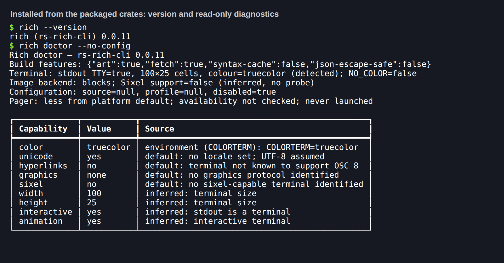
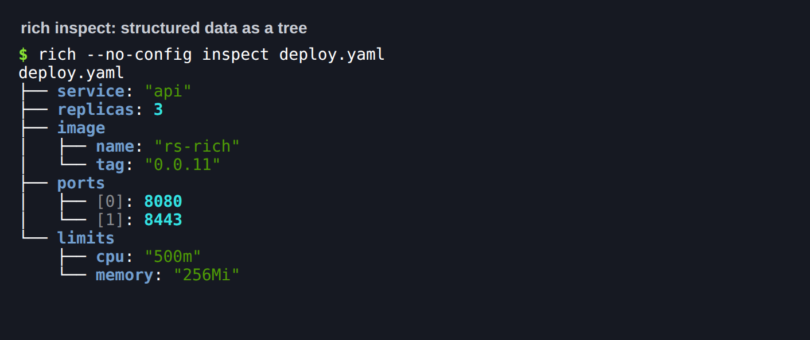
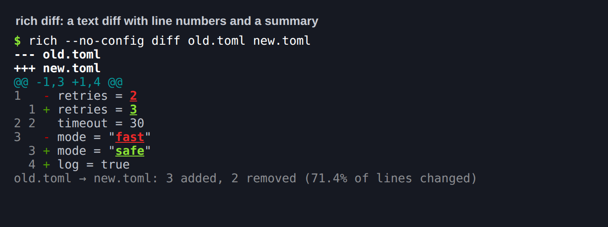
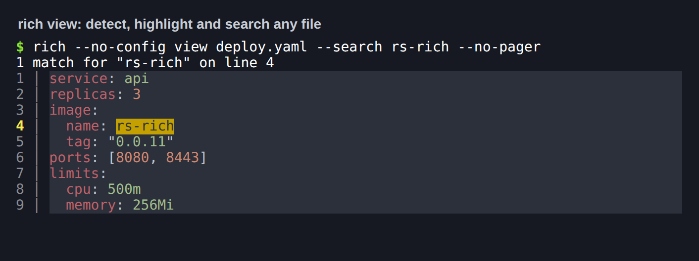
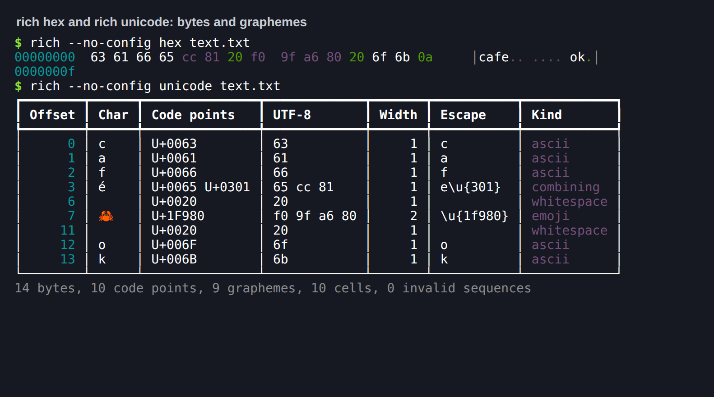
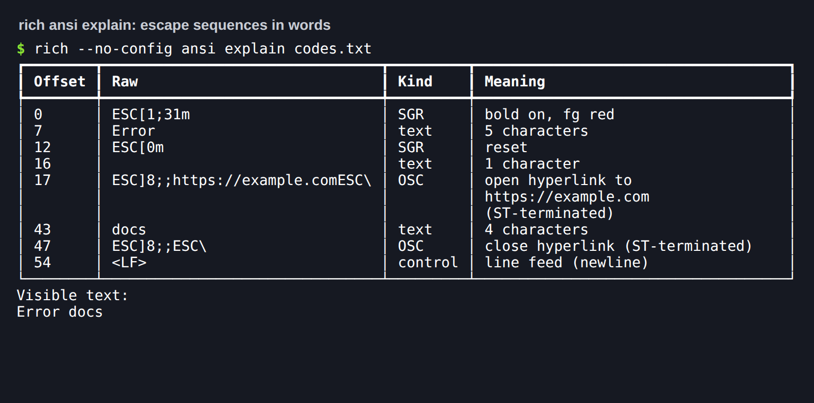
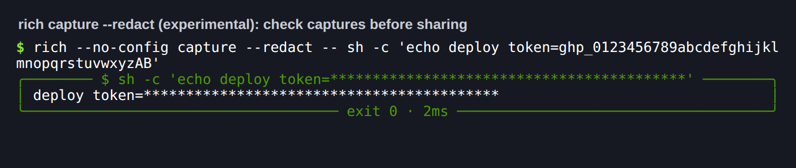
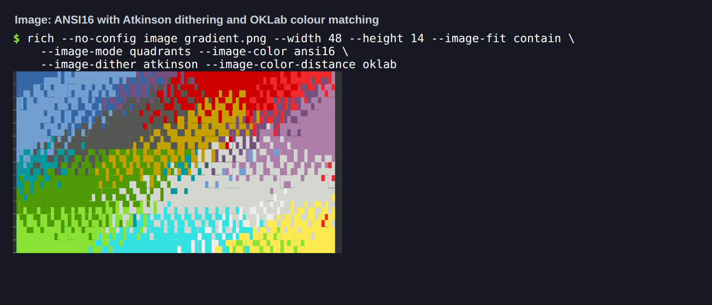
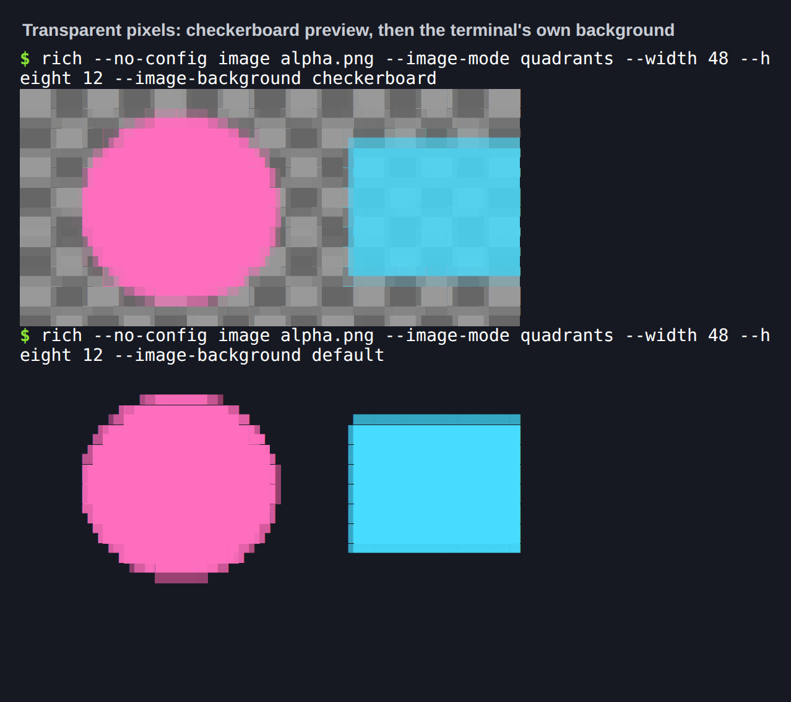
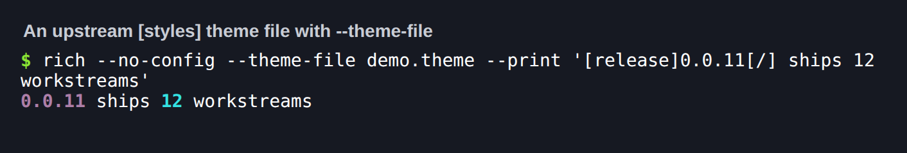

# 0.0.11 cohort: developer ergonomics and core usability

**Published 2026-09-24.** Every workstream in the [0.0.11 plan](../plans/0.0.11.md)
shipped, and the release test below passed on the integrated tree. All five
packages are on crates.io; `rs-rich-macros` is new. See [Publication](#publication).

## Independent package versions

| Package | Version | Release role |
|---|---|---|
| `rs-rich` | 0.0.7 | Parity fixes #442–#449, Markdown styled table cells (#9), the rest of Progress (#6), `LogRender` (#10), markup/measurement, Columns/Tree and no_color/spinner/prompt parity, and the release-test fixes |
| `rs-rich-macros` | 0.0.1 (new) | Checked markup and styles (`richf!`, `style!`, `theme_key!`, `markup!`) and `#[derive(Rich)]` |
| `rs-rich-ext` | 0.0.9 | Diagnostics and stack traces, structured data and serde, CLI authoring and `clap`, diffs and test reports, capabilities and accessibility, tracing spans, inspectors, and the workflow renderables |
| `rs-rich-art` | 0.0.9 | Atkinson dithering, OKLab colour distance, Sixel/GIF colour modes, terminal-default and checkerboard alpha backgrounds |
| `rs-rich-cli` | 0.0.11 | `inspect`, `diff`, `view`, `hex`, `unicode`, `env`, `capture`, `ansi explain`, `doctor`, `bench compare`, rich-rendered help, completions and docs, `--format`, `--theme-file` |

Internal requirements are exact `0.0.x` pins, so the cohort moves together and
`cargo tree` holds one `rs-rich`. Publish in dependency order, one tag at a time:
core, then macros, then ext and art, then the CLI.

## What changed

The [changelog](https://github.com/buchochelliq-labs/rs-rich-cli/blob/main/CHANGELOG.md)
has the full list. By workstream:

| Workstream | Pull request |
|---|---|
| 1. Core parity fixes (#442–#449) | #497 |
| 2. Markdown styled table cells (#9); Progress pulse, columns, live display, `track()`, grid, transient, file reading (#6); `LogRender` and `RichHandler` (#10) | #501, #502, #503, #504 |
| 3. Diagnostics, hyperlinks, stack traces, dashboard, error adapters | #505 |
| 4. Structured data, serde helpers, `rich inspect`, `--format` | #506 |
| 5. `rs-rich-macros` 0.0.1 | #505 |
| 6. CLI authoring: help, errors, completions, docs, config reference, `clap` | #506 |
| 7. Tracing spans, span views, editor links, Live-safe logging | #514 |
| 8. Diff engine, source/patch/test-report views, assertions, QA tooling, `rich diff`, `rich bench compare` | #507 |
| 9. Capabilities, fidelity, accessibility, `rich ansi explain`, `rich doctor` | #507 |
| 10. Commands, task trees, summaries, transfers, countdowns, notifications, streaming/sorted tables, badges, size bars, formatters, redaction | #517 |
| 11. `rich view`, `hex`, `unicode`, `env`, `capture` | #515 |
| 12. Atkinson, OKLab, Sixel/GIF colour modes, alpha backgrounds, `--theme-file` | #516 |

Redaction (`rich_ext::redact`, `rich capture --redact`) is **experimental** and
best effort: check redacted output before sharing it, and
[report](https://github.com/buchochelliq-labs/rs-rich-cli/issues/new?template=bug_report.yml)
anything that gets through.

## Migration

- **Markup in cells and labels (core).** A plain-string table header, cell or
  tree label is now parsed as markup, as upstream does. Pass `Text` or
  `markup::escape` to keep it literal; `Tree::new`/`add` take `impl Into<Cell>`.
  Malformed markup prints literally (DIVERGENCES §2).
- **`LogRender` (core).** The old one-line `LogRender::new(level, message)` is now
  `LogRecord` with the same builders plus `.line(n)`; `LogRender::new()` takes no
  arguments and renders each record with `.render(...)`. `Table::grid()` has
  upstream's defaults (no padding, `collapse_padding`).
- **Exhaustive matches.** `ProgressColumn` gains `BarWith` and `WithTableColumn`;
  art's `Dither` gains `Atkinson`.
- **Art background.** The internal `ImageArt` background field is an
  `ImageBackground`; the `background([r, g, b])` builder is unchanged.
- **Release-test additions.** `StackTrace` has a public `omitted_causes` field;
  `unicode_inspect::Kind` gains `Bidi` and `ImageArtError` gains `SixelTooLarge`
  and `SixelNotSupported`. `richf!` now prints a value's `\[` literally. A
  truncated JUnit file is an error. `rich view` and text `rich diff` sanitise
  terminal controls by default (`--no-sanitize` opts out), and a
  working-directory `rich.toml` can no longer set `theme_file`, `export_html` or
  `export_svg`, or turn sanitising off. Move those settings to
  `~/.config/rich/config.toml`, a file given with `--config`, or the command
  line.

## Release test (2026-09-24)

Run on the integrated tree (`main` through #517, plus this branch's release
fixes), with Rust 1.98.1 stable and `NO_COLOR` unset.

| Check | Result |
|---|---|
| `python scripts/validate_release.py --tag rs-rich-cli-v0.0.11` | All 15 steps pass: fmt, three Clippy configurations, 1,691 Rust tests (0 failed), lean CLI tests, 36 Python release tests, version and CLI-reference checks, locked build and check, staged packages for all five crates, tag plan |
| `capture_golden.py` against real `rich` 15.0.0 (dedicated venv, no rich-cli) | All 31 fixture files regenerate byte-identically |
| `release.py plan` per tag | `rs-rich-v0.0.7`, `rs-rich-macros-v0.0.1`, `rs-rich-ext-v0.0.9`, `rs-rich-art-v0.0.9`, `rs-rich-cli-v0.0.11` each select exactly their own package |
| `release.py plan v0.0.11` | Rejected: `rs-rich-art: manifest says 0.0.9, tag says 0.0.11` |
| crates.io API | 404 for all five new versions; 200 for the published 0.0.10 cohort |
| Existing tags | None of the five new tags exist on the remote |
| Consumer install | `cargo install` from the packaged `rs-rich-cli-0.0.11` source, with siblings patched only to their packaged `.crate` contents: release build succeeds, `rich --version` reports 0.0.11 |
| Library consumer | A fresh crate pinned to `=0.0.7`/`=0.0.9` packaged core/ext with `macros`, `data` and `yaml`: `richf!` keeps hostile values literal, formatters, experimental redaction, `TaskTree` on a `ManualClock`, `TableData::sort_by`, YAML through `data::parse` |
| CI scripts against the installed binary | `test_cli_terminal.py` (3), `test_demo_pty.py` (5 process checks), `test_batch_v9.py`, `snapshot_cli.py` (6 workflow snapshots), `test_watch_workflows.py` (12), `test_live_regions_pty.py`, and the differential corpus (57 of 57 match rich 15.0.0) |
| Security | `cargo audit`: no vulnerabilities (one unmaintained warning, `bincode` 1 via syntect) |
| Docs | `mkdocs build --strict` passes; `gen_versions.py --check` and `gen_cli_reference.py --check` match |

The patched consumer stands in for registry resolution before publication; each
release run builds an exact-version registry consumer after upload.

### What the release test found and fixed

Six independent audits covered the whole 0.0.11 delta: core, diagnostics and
macros, structured data and CLI authoring, diff and inspectors, the CLI, and art.
Each finding was confirmed by reproduction and fixed with a regression test
that failed first. About 70 were fixed; the
[changelog](https://github.com/buchochelliq-labs/rs-rich-cli/blob/main/CHANGELOG.md)
lists every one. The main ones:

- **Terminal-control injection.** Markdown link destinations now go through
  ports of markdown-it's `normalizeLink` and `validateLink`, so an escape
  sequence in a link can't reach the terminal. OSC 8 links could be broken out
  of in `LiveCoordinator`, `Hyperlinker` and diff templates. Stack-trace
  labels, patch paths and test-report names decoded from escapes now render
  inert. `rich view` could pass a clipboard-writing OSC 52 to the terminal:
  `view` and text `diff` now sanitise by default. Bidi controls show as escapes.
- **Secrets.** `rich env` masks secret names by whole segment, and credentials
  inside any value. `--redact` covers dash spellings, containers under a secret
  key, and XML text. Redaction stays experimental.
- **Resource exhaustion.** YAML alias and nested-anchor memory bombs, JSONPath
  overflow and nesting, GIF decoding (a 35-byte GIF asked for 17 GB), Sixel
  rasters, deep JSON, `Tree` and stack-trace recursion. `capture` stops reading
  1 s after the command exits, even while a background child holds the pipe.
- **Quadratic paths.** Minified XML and TOML parsing (35 s to 0.3 s for 200,000
  elements), libtest reports, wrapped `SourceView` lines, and core
  `Text::divide`: rendering 40,000 highlighted lines in `rich view` went from
  132 s to 11 s. That change matches upstream's own line lookup.
- **Config trust.** A working-directory `rich.toml` can no longer set
  `theme_file`, choose export files (`export_html`, `export_svg`) or turn off
  sanitising. Theme files must be regular files of at
  most 1 MiB.
- **Parity.** Justify padding, zero-width table cells, negative byte columns,
  and `TextColumn` format specs (3,836 golden cases) now match rich 15.0.0.
- **Generated scripts.** zsh and fish completions and man pages can no longer
  be injected into. Completions offer each subcommand's own options and the
  global options.
- **Dependencies.** `rustls` 0.23.45 (RUSTSEC-2026-0285, `fetch` only). Core
  loads syntect's bundled dumps, which drops `yaml-rust` and `plist`.
  `cargo audit` reports no vulnerabilities; `bincode` 1 is flagged unmaintained
  (a syntect dependency).
- **Tests.** Two intermittent failures were root-caused. `test_batch_v9.py`
  stopped a worker inside `posix_spawn`'s vfork, which suspended the parent. A
  timing test used a wall-clock limit; it now compares two sizes, which is how
  the quadratic XML parse was found.
- **Screenshot tooling.** node-pty dropped output still buffered when the
  command exited, so a large image came out cut off. `shoot.js` now holds the
  PTY open after exit. It also loads xterm.js's Unicode 11 widths, so emoji
  take two cells.
- **Help.** `--image` help now lists quadrants, and the Sixel fallback message
  names `RICH_GRAPHICS=sixel`.

## Publication

Independent annotated tags on `main` at `433c1b1` (#520), published one at a time
in dependency order. No coordinated `v0.0.11` tag exists; the release script
rejects it.

| Package | How | Run | crates.io |
|---|---|---|---|
| `rs-rich` 0.0.7 | `rs-rich-v0.0.7`, Trusted Publishing | [36063309820](https://github.com/buchochelliq-labs/rs-rich-cli/actions/runs/36063309820) | [rs-rich 0.0.7](https://crates.io/crates/rs-rich/0.0.7) |
| `rs-rich-macros` 0.0.1 | By hand with a maintainer API token | — | [rs-rich-macros 0.0.1](https://crates.io/crates/rs-rich-macros/0.0.1) |
| `rs-rich-ext` 0.0.9 | `rs-rich-ext-v0.0.9`, Trusted Publishing | [36065371117](https://github.com/buchochelliq-labs/rs-rich-cli/actions/runs/36065371117) | [rs-rich-ext 0.0.9](https://crates.io/crates/rs-rich-ext/0.0.9) |
| `rs-rich-art` 0.0.9 | `rs-rich-art-v0.0.9`, Trusted Publishing | [36065405590](https://github.com/buchochelliq-labs/rs-rich-cli/actions/runs/36065405590) (attempt 3) | [rs-rich-art 0.0.9](https://crates.io/crates/rs-rich-art/0.0.9) |
| `rs-rich-cli` 0.0.11 | `rs-rich-cli-v0.0.11`, Trusted Publishing | [36065429562](https://github.com/buchochelliq-labs/rs-rich-cli/actions/runs/36065429562) (attempt 2) | [rs-rich-cli 0.0.11](https://crates.io/crates/rs-rich-cli/0.0.11) |

**Why macros was uploaded by hand.** crates.io offers Trusted Publishing only on
a crate that already exists, so a new crate's first version needs a maintainer
token. It went up after core 0.0.7 and before the ext tag, whose optional
`macros` dependency must resolve. Later versions publish from the workflow once
its Trusted Publishing entry is added. See
[Registry authentication](../BRANCHING.md#registry-authentication-trusted-publishing).

**Registry check.** Each tag's release run waited for its version on crates.io,
then built an exact-version registry consumer (the CLI run installs
`rs-rich-cli@=0.0.11 --locked`); all four passed. Independently, a fresh
`cargo install --locked rs-rich-cli@=0.0.11` from crates.io reported 0.0.11. A
new crate pinned to `=0.0.7`/`=0.0.9` with ext's `macros`, `data` and `yaml`
features resolved `rs-rich-macros` 0.0.1 from the registry and ran `richf!`, a
formatter and YAML parsing.

## Installed-binary screenshots

Each image is a real PTY run of the installed consumer binary
(`TERM=xterm-256color`, truecolor). The captured bytes are replayed verbatim
into xterm.js in headless Chromium, and only the caption line is added. Hashes
of the raw PTY bytes, the PNGs, the binary and the packaged crates are in
[`provenance.json`](../media/release-0.0.11/provenance.json). Reproduce with
`scripts/terminal_shots/make_cases.py --release 0.0.11`.

In the unicode capture, `e` plus a combining acute is one grapheme of two code
points. The fixture avoids a ZWJ emoji sequence because xterm.js 5 has no
grapheme clustering and would draw it six cells wide. The redacted capture masks
the token in both the title and the body. The [guided tour recording](../demos.md)
is also re-recorded from the installed 0.0.11 binary.

## Issue disposition

| Issue | State | Suggested disposition |
|---|---|---|
| Every other issue the [plan](../plans/0.0.11.md) assigns to a workstream, including #442–#449, #6, #9, #10, #34, #498 and #499 | Closed | Done |
| #126 image transforms | Closed | Done. The one remaining item, native sizing (an image at its own pixel size), moved to #519 for 0.0.12 |
| #144 art in the CLI | Open | Keep open for future renderer and backend APIs |
| #500 tracker | Closed | Published |

## Known gaps

- **By design.** `rich capture` without `--sanitize` passes C1 controls to the
  panel, as it does other controls.
- **Registry.** Add `rs-rich-macros`'s Trusted Publishing entry on crates.io, if
  not done yet, so 0.0.2 can publish from the workflow.
- **Coverage.** The CLI's 20,000-line `view` cap stays; the library renders
  larger files, more slowly. Windows is covered by CI (`windows-latest`), not by
  this local run.
