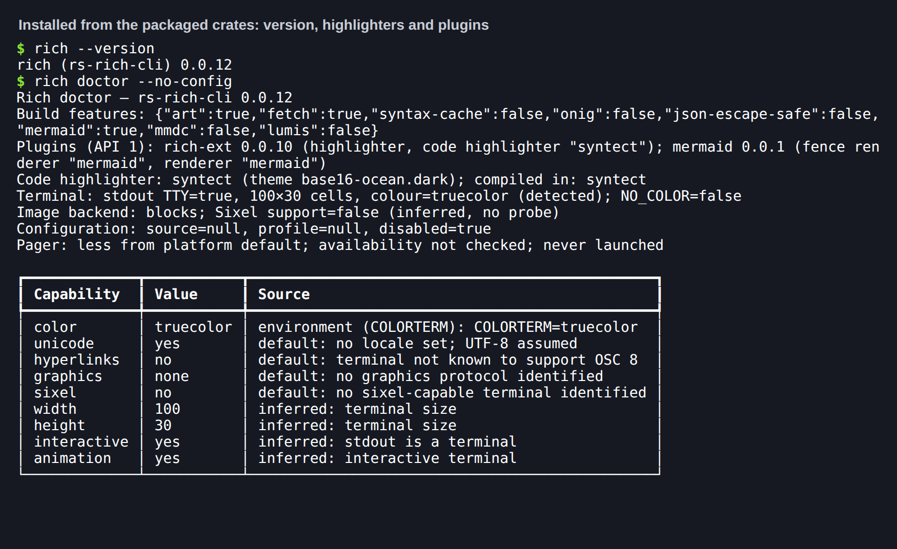
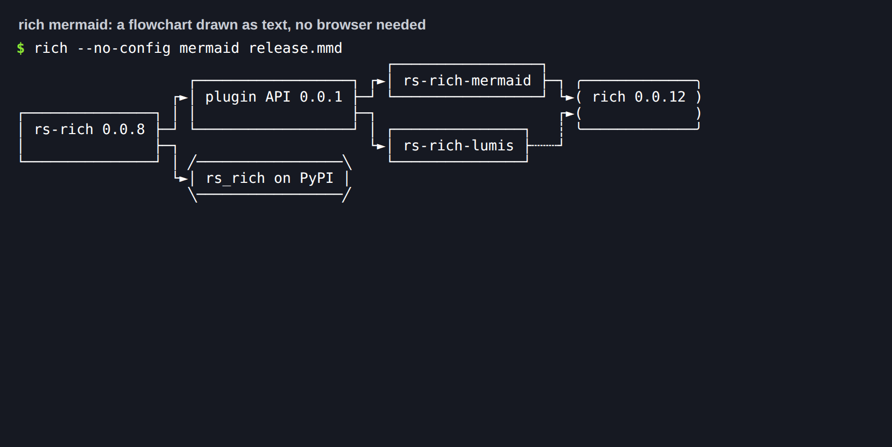
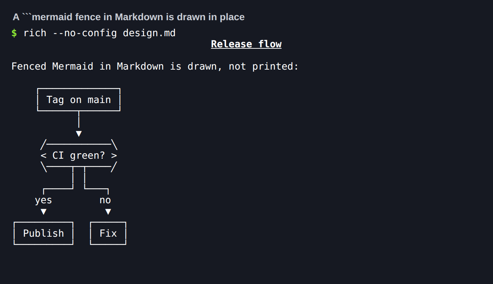
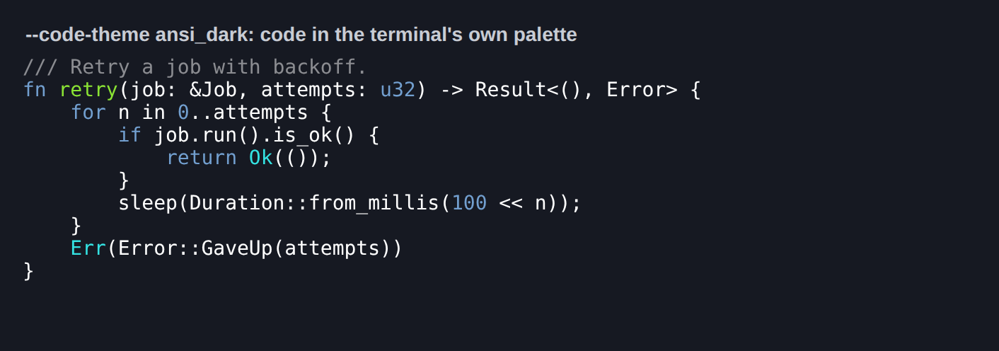
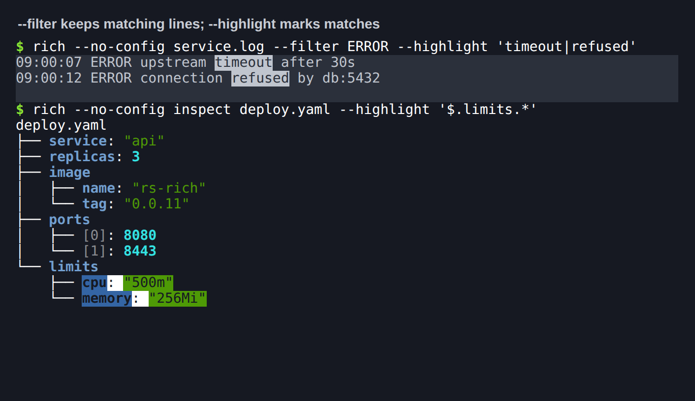
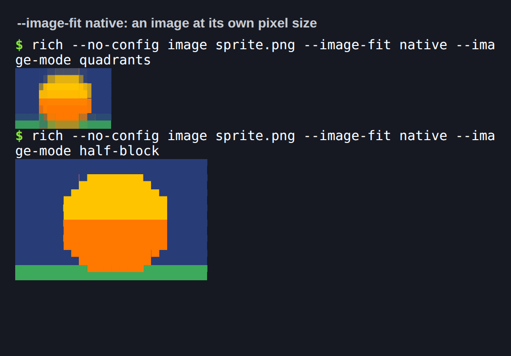
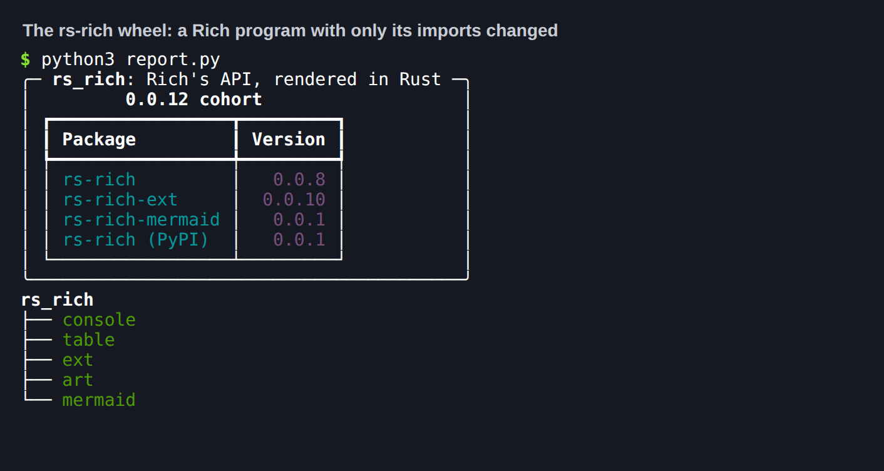

# 0.0.12 cohort: plugin platform and extensibility

**Prepared, not yet published.** Every workstream in the
[0.0.12 plan](../plans/0.0.12.md) is merged, and the release test below passed
on the integrated tree. Publishing is a maintainer step; see
[Publication](#publication).

0.0.12 makes `rs-rich` something other crates plug into, not just something
they call:

- one public, documented way to register extensions: the new
  `rs-rich-plugin-api` crate;
- a pluggable code highlighter, with syntect as the default and lumis
  (tree-sitter) as a second engine;
- Markdown code fences that plugins can draw, starting with Mermaid
  flowcharts as text;
- composable transforms, behind the CLI's `--filter` and `--highlight`;
- native image sizing;
- a first slice of Python bindings, `rs-rich` on PyPI.

Core still learns nothing about any one extension. It gains extension-point
traits only, and a default build still renders exactly like upstream
`rich` 15.0.0.

## Independent package versions

| Package | Version | Release role |
|---|---|---|
| `rs-rich` | 0.0.8 | The `CodeHighlighter` and `FenceRenderer` seams, the syntect adapter with ANSI themes, and parity fixes (header-less table boxes, a lone `\r` in code, a zero-width `Panel`) |
| `rs-rich-plugin-api` | 0.0.1 (new) | The plugin contract: `Plugin`, `PluginRegistrar`, capabilities and `PLUGIN_API_VERSION` |
| `rs-rich-macros` | 0.0.2 | Exact core pin |
| `rs-rich-ext` | 0.0.10 | The plugin host, transforms, and the highlighter conformance kit |
| `rs-rich-art` | 0.0.10 | Core pin and `ImageFit::Native` |
| `rs-rich-lumis` | 0.0.1 (new) | The lumis highlighter as a plugin |
| `rs-rich-mermaid` | 0.0.1 (new) | Mermaid flowcharts as text, and an optional `mmdc` backend |
| `rs-rich-cli` | 0.0.12 | `rich mermaid`, `--highlighter`, `--code-theme`, `--filter`, `--highlight`, `--image-fit native` |
| `rs-rich` on PyPI | 0.0.1 (new) | Python bindings, imported as `rs_rich`; built from `crates/rich-py`, which is never on crates.io |

Internal requirements are exact `0.0.x` pins, so the cohort moves together and
`cargo tree` holds one `rs-rich`.

## What changed

The [changelog](https://github.com/buchochelliq-labs/rs-rich-cli/blob/main/CHANGELOG.md)
has the full list. By workstream:

| Workstream | Pull requests |
|---|---|
| 1. Pluggable code highlighters: the core trait, the syntect adapter and ANSI themes (#522, #523), `rs-rich-lumis` (#524), choosing one (#525), the conformance kit (#526) | #531, #534, #535, #536 |
| 2. The public plugin API and ext's host | #532 |
| 3. Markdown fences and Mermaid (#222) | #533 |
| 4. Composable transforms (#216) | #538 |
| 5. Render tree spike (#226), a design note only | #539 |
| 6. Native image sizing (#519) | #540 |
| 7. Python bindings, first slice (#197) | #541 |

## Migration

- **New crates.** Plugins depend on `rs-rich-plugin-api`, not on `rs-rich-ext`.
  Plugin and capability names are lowercase letters, digits, `-`, `_` and `.`,
  and start with a letter or digit.
- **Default output is unchanged.** With no plugin registered and no highlighter
  chosen, every golden and the differential corpus are byte-identical to
  rich 15.0.0. Three parity fixes change output only where it was wrong:
  - a table without a header draws head-styled boxes plain, as upstream does;
  - a lone `\r` in `Syntax` code breaks the line;
  - a `Panel` in no width renders nothing.
- **CLI.** `mermaid` is a default feature; `lumis` and `mmdc` are off by
  default. `mermaid_backend = "mmdc"` in a user config, on a build without
  mmdc, now warns and draws text instead of failing.

## Release test (2026-09-26)

| Check | Result |
|---|---|
| `python scripts/validate_release.py --tag rs-rich-cli-v0.0.12` | All 15 steps pass: fmt, three Clippy configurations (default, all features, lean CLI), 1,894 Rust tests in 130 suites (0 failed, 2 ignored), lean CLI tests, 36 Python release tests, version and CLI-reference checks, locked build and check, staged packages for all eight crates, tag plan |
| `capture_golden.py` against real `rich` 15.0.0 (dedicated venv, no rich-cli) | All 33 fixture files regenerate byte-identically |
| `release.py plan` per tag | `rs-rich-v0.0.8`, `rs-rich-plugin-api-v0.0.1`, `rs-rich-macros-v0.0.2`, `rs-rich-ext-v0.0.10`, `rs-rich-art-v0.0.10`, `rs-rich-mermaid-v0.0.1`, `rs-rich-lumis-v0.0.1`, `rs-rich-cli-v0.0.12` each select exactly their own package; `python-v0.0.1` belongs to `pypi-release.yml`, which checks it against `pyproject.toml` |
| crates.io API | 404 for all eight new versions |
| Consumer install | `cargo install` from the packaged `rs-rich-cli-0.0.12` source, with siblings patched only to their packaged `.crate` contents (`cargo tree` confirms every sibling resolves to its package): release build succeeds, `rich --version` reports 0.0.12, `rich mermaid` draws a flowchart |
| Library consumer | A fresh crate pinned to `=0.0.8` core, `=0.0.10` ext (`data`, `yaml`) and art, `=0.0.1` Mermaid and plugin API, all packaged: a `Mermaid` diagram, `MermaidPlugin` registered on `ExtensionRegistry` and its fences routed into `Markdown` through `registry.fences()`, `MermaidFences` directly, YAML through `data::parse` into an `Explorer` |
| Python wheel | `maturin build --release`, installed into a fresh venv with `rich==15.0.0` and `pytest`: the whole suite passes against the installed wheel (1,052 passed, 1 skipped), `rich-rs --version` reports 0.0.12 |
| Python sdist | Installed from source into a fresh venv: builds, renders a `Table` and a `Mermaid` diagram, `rich-rs` works |
| CI scripts against the installed binary | `test_cli_terminal.py`, `test_demo_pty.py` (5 process checks), `test_batch_v9.py`, `snapshot_cli.py` (workflow snapshots), `test_watch_workflows.py` (12), `test_live_regions_pty.py`, and the differential corpus (57 of 57 match rich 15.0.0) |
| Security | `cargo audit`: no vulnerabilities (one unmaintained warning, `bincode` 1 via syntect) |
| Docs | `mkdocs build --strict` passes for the main site and the Python site (`mkdocs-python.yml`); `gen_python_api.py --check` (96 pages), `gen_versions.py --check` and `gen_cli_reference.py --check` match |

The patched consumer stands in for registry resolution before publication; each
release run builds an exact-version registry consumer after upload.

### What the release test found and fixed

Five independent audits covered the whole 0.0.12 delta: core, the plugin API
and ext host, Mermaid, art and the CLI flags, and the Python bindings. Each
finding was reproduced by a test that failed first. 30 were fixed; the
[changelog](https://github.com/buchochelliq-labs/rs-rich-cli/blob/main/CHANGELOG.md)
lists every one. The main ones:

- **Denial of service in Mermaid.** A Markdown file of under 1 KiB could hang
  `rich README.md` for four minutes: link dashes set the rank span with no cap,
  and the layout was quadratic before any size check. Links now span at most
  10 ranks, the layout budget is checked first, and crossings are counted in
  O(E log V). The same input is refused in 0.1 s.
- **`mmdc` process hygiene.** Ctrl-C left `mmdc` (and Chromium) running and
  its temporary directory behind; its output was read into memory with no
  cap. Both are fixed.
- **Plugins.** A plugin that panics while registering is refused instead of
  crashing the host. Names that read as flags or paths are refused.
- **Python bindings.** Using a `Console`, `Table` or `Panel` from a second
  thread raised `PanicException`; deep nesting could crash the interpreter;
  huge sizes aborted it. The objects are now thread-safe, and the limits raise
  Python exceptions.
- **Parity.** A lone `\r` in code joined two lines (and `Panel.fit` then lost
  one), a zero-width `Panel` printed two blank lines, and a huge column ratio
  overflowed. Each now matches rich 15.0.0.
- **CLI.** `rich doctor` failed on the very setting it is meant to explain;
  `config validate` accepted names every render rejects; `--filter` and
  `--highlight` changed `--syntax` output even when nothing matched.
- **Workflows.** The PyPI release now tests the wheel before publishing, and
  third-party actions are pinned by commit.

A second round then covered the Python package end to end, now that it wraps
every crate: the console and threads, live displays, renderables (by
differential fuzzing against rich 15.0.0: about 7,000 generated programs), and
the ext, art, plugin and CLI surface. Its findings are fixed the same way, with
regression tests in `crates/rich-py/tests/test_robustness_*.py`, and 22 new
golden cases. The main ones:

- **Crashes.** A print re-entered from what it prints, deeply nested data in
  `Pretty`, and leaving a `Live` just before the interpreter exits could each
  kill the interpreter; a tiny, very tall image could hang or abort `rich
  --image`. All now raise, render as Rich does, or stay within a cell budget.
- **Performance.** Printing text with many styled spans was quadratic in core
  (`print(list(range(10000)))` took 83 s); it is linear now, with output
  unchanged. Markdown with many brackets, `Text.stylize` and deep task trees
  were quadratic too.
- **Parity.** `markup=False` now reaches strings inside containers; a print's
  `end` keeps its newline when cropped; Markdown inherits overflow; the Windows
  palette, markup error positions, blank lines for empty renderables and
  explicit `justify="default"` match rich 15.0.0.

## Publication

Not yet published. The plan's order, one tag at a time, all on `main`:

1. `rs-rich-v0.0.8`;
2. `rs-rich-plugin-api` 0.0.1, uploaded by hand (a new crate's first version
   needs a maintainer token), then its Trusted Publishing entry;
3. `rs-rich-macros-v0.0.2`;
4. `rs-rich-ext-v0.0.10` and `rs-rich-art-v0.0.10`;
5. `rs-rich-lumis` 0.0.1 and `rs-rich-mermaid` 0.0.1, each uploaded by hand
   first;
6. `rs-rich-cli-v0.0.12`;
7. `python-v0.0.1`, which publishes `rs-rich` to PyPI through the `pypi`
   environment. Create that environment before tagging.

No coordinated `v0.0.12` tag: the release script rejects it.

## Installed-binary screenshots

Each image is a real PTY run of the installed consumer binary, and for the
last one of the installed wheel's `python3` (`TERM=xterm-256color`, truecolor).
The captured bytes are replayed verbatim into xterm.js in headless Chromium,
and only the caption line is added. Hashes of the raw PTY bytes, the PNGs, the
binary, the wheel and the packaged crates are in
[`provenance.json`](../media/release-0.0.12/provenance.json). Reproduce with
`scripts/terminal_shots/make_cases.py --release 0.0.12`.

