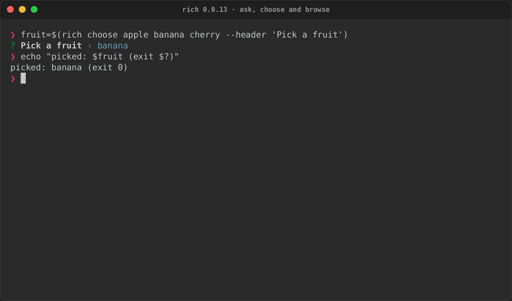
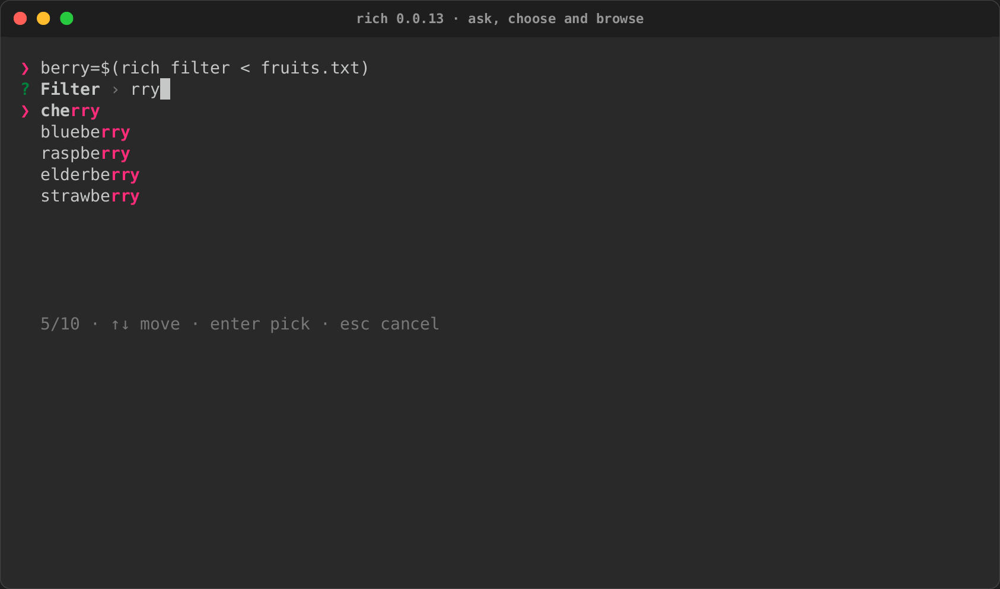
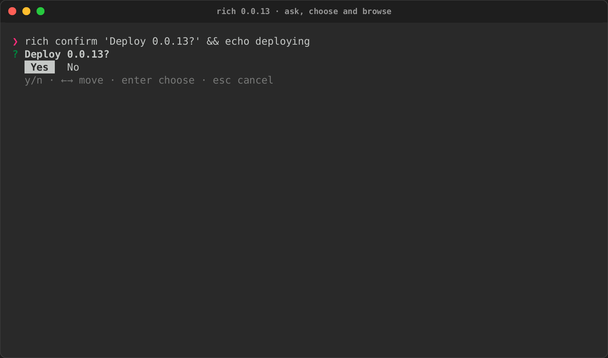
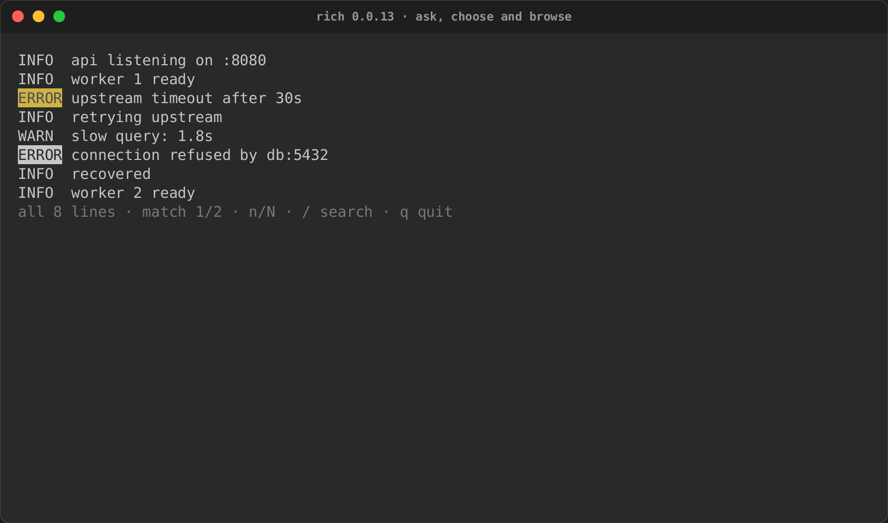
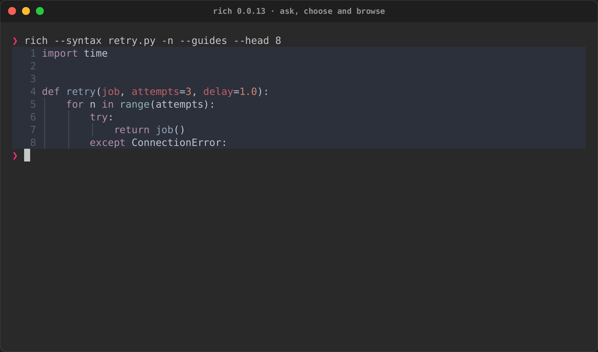
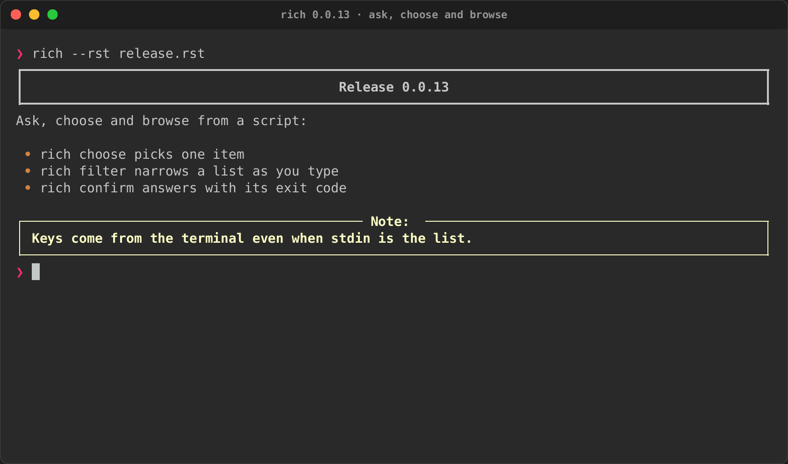

# 0.0.13 cohort: interactive CLI, first slice

**Not yet published.** Every workstream in the
[0.0.13 plan](../plans/0.0.13.md) is implemented, and the release test below
passed on the integrated tree. See [Publication](#publication) for the order
the packages go out in.

0.0.13 lets a command line ask, choose and browse, not only print:

- a new crate, `rs-rich-interact`, with interactive components (a fuzzy
  selector and multi-selector, input, confirm, form and a pager with search),
  each run either as a blocking call that returns a value or inside a small
  event loop;
- frames: a styled-cell frame with a cell diff, so interactive views and
  `Live` repaint only what changed;
- the same components from the `rich` binary (`rich choose`, `filter`,
  `input`, `confirm`, `pager`) and from Python (`rs_rich.interact`);
- the rest of rich-cli 1.8.1's options, including `--rst`;
- `rich record`: every terminal recording in the docs is now a tape, run by
  the CLI's own recorder.

Core does not change. A default build of `rs-rich` still renders exactly like
upstream `rich` 15.0.0.

## Independent package versions

| Package | Version | Release role |
|---|---|---|
| `rs-rich` | 0.0.8 (unchanged) | No core change |
| `rs-rich-ext` | 0.0.11 | Frames, `RenderTarget::frame`, the live cell diff, snapshot schema 2, the rich-rst port behind `--rst` |
| `rs-rich-interact` | 0.0.1 (new) | The interactive layer: session, events, event loop, viewport, degradation policy, components |
| `rs-rich-record` | 0.0.1 (new) | Tapes and `rich record`: PTY, VT emulator, PNG/SVG/GIF/MP4 and cast renderers |
| `rs-rich-cli` | 0.0.13 | Interactive commands, rich-cli options, `--rst`, `rich record`, non-UTF-8 paths |
| `rs-rich` on PyPI | 0.0.2 | `rs_rich.interact`, frames, the new CLI commands, nesting depth as Rich's |
| `rs-rich-plugin-api`, `rs-rich-macros`, `rs-rich-art`, `rs-rich-mermaid`, `rs-rich-lumis` | unchanged | No change to what they publish |

## What changed

The [changelog](https://github.com/buchochelliq-labs/rs-rich-cli/blob/main/CHANGELOG.md)
has the full list. By workstream:

| Workstream | Pull requests |
|---|---|
| 1. Frames (#226) | #597 |
| 2. `rs-rich-interact` foundation (#451, #452, #489, #492, #495) | #603 |
| 3. First components (#287, #288, #289, #291, #454, #457, #470, #472) | #604 |
| 4. rich-cli options (#542), `--rst`, and the interactive commands (#493, #494) | #605, #606, #607 |
| 5. Python: `rs_rich.interact` and frames | #609 |
| 6. Hardening carried over from 0.0.12 | #608 |
| 7. Tapes and `rich record` (#598, #599, #600) | #601, #602 |

## Migration

- **`-h` means `--head`**, as in rich-cli 1.8.1, so `rich -h 20 file` works as
  upstream scripts expect. Help is `--help` only. Anyone who typed `rich -h`
  for help now gets a usage error that points at `--help`.
- **New command words.** `choose`, `filter`, `input`, `confirm`, `pager` and
  `record` are commands, as `view` and `inspect` are. A file literally named
  one of them needs a path: `rich ./choose`.
- **New default features** in `rs-rich-cli`: `interact` and `record`. Build
  with `--no-default-features` and the features you want for a smaller binary.
- **Python nesting depth.** Renderables used to stop at a fixed 100 levels;
  they now stop where Rich does (about 123 at the default recursion limit),
  following the recursion limit.

## Release test (2026-09-28)

| Check | Result |
|---|---|
| `python scripts/validate_release.py --tag rs-rich-cli-v0.0.13` | All 15 steps pass: fmt, three Clippy configurations (default, all features, lean CLI), 1,848 Rust tests in 120 suites (0 failed, 2 ignored), 345 lean CLI tests, the release, readiness and package tests, version and CLI-reference checks, locked build and check, staged packages for every crate, tag plan |
| `capture_golden.py` against real `rich` 15.0.0 (its own venv, no rich-cli) | All 36 golden files regenerate byte-identically |
| `capture_rst_golden.py` against rich-rst 1.3.2 on rich 15.0.0 | Every `--rst` fixture regenerates byte-identically, including the new `structure` case |
| `release.py plan` per tag | `rs-rich-ext-v0.0.11`, `rs-rich-interact-v0.0.1`, `rs-rich-record-v0.0.1` and `rs-rich-cli-v0.0.13` each select exactly their own package; `python-v0.0.2` belongs to `pypi-release.yml` |
| crates.io and PyPI | 404 for all five new versions |
| Consumer install | `cargo install` from the packaged `rs-rich-cli-0.0.13` source, with only the three unpublished siblings (ext 0.0.11, interact and record 0.0.1) patched to their packaged `.crate` contents and every other crate from crates.io: `rich --version` reports 0.0.13, and it recorded the release tape below |
| Docs tapes | `rich record --check` passes for all seven tapes (the tour with its new "Ask in a script" section, and the release tape) |
| Python wheel | Pending: the release build is running |
| Python sdist | Pending: built with the wheel |
| Security | `cargo audit`: nothing reported (the two unmaintained warnings are recorded in `.cargo/audit.toml`) |
| Docs | `mkdocs build --strict` passes for the main site and the Python site; `gen_python_api.py --check` (98 pages), `gen_versions.py --check` and `gen_cli_reference.py --check` match |

### What the release test found and fixed

Four independent audits covered the whole 0.0.13 delta:
- frames and `rs-rich-record`;
- `rs-rich-interact` and the interactive commands;
- the rich-cli options, `--rst` and paths;
- the Python bindings.

About fifty findings were each reproduced first, then fixed with a
regression test that failed before the fix. The
[changelog](https://github.com/buchochelliq-labs/rs-rich-cli/blob/main/CHANGELOG.md)
lists every one. The main ones:

- **Data loss.**
  - A tape named `...tape` made `rich record` write outside its output
    directory, and its orphan cleanup delete files there. Such names are now
    refused, and only screenshots the recorder itself listed are ever
    removed.
  - `rich $'\xff.txt' --export-html '�.txt'` overwrote its own input: a
    non-UTF-8 argument shared its lossy spelling with a real file.
    Non-UTF-8 arguments and paths are now spelled in a form no real path or
    argument can take.
- **Crashes and hangs.**
  - `--rst` overflowed the stack on about 3 KB of nested list markers.
  - The pager's search panicked on text whose lower case changes byte
    lengths (`Ⱥẞ`).
  - A Python validator that started another run segfaulted the interpreter.
  - A `Pretty` of an endless iterable in 32 or more panels hung.
  - The fuzzy matcher could exhaust memory on a long query.
  - Terminal-emulator panics, and huge sizes or durations in a tape, now
    fail the tape instead.
  - Recording fast output grew without bound (about 4 GB in 15 s).
  - RST inline parsing was quadratic.
- **The terminal.**
  - SIGTERM, SIGHUP and SIGQUIT left raw mode and the alternate screen
    behind.
  - Escape sequences in pager content, `--preview` output, pasted text,
    item labels and prompts reached the terminal. They are now painted as
    text.
  - The live cell diff left stale cells where a terminal measures an emoji
    differently from rich.
- **Scripts.**
  - Without a terminal, `confirm --default yes`, `input --default` and
    `choose --selected` ignored their default at the end of input.
  - Invalid UTF-8 on stdin failed the command.
  - stdin was unbounded.
  - A slow `--preview` froze the picker.
  - `--multi` answered with nothing; `--no-color`, `--report json`,
    `-J`/`-u` with a configured mode, and `--sanitize` with `--rule-char`
    were ignored.
- **Parity.**
  - Python nesting stopped one level short of Rich on CPython 3.12 and
    later. It now matches rich 15.0.0 exactly on 3.9 to 3.13, including
    `max_depth` and `max_length`.
  - `--rst` grid tables drop no text in spanned cells, section titles render
    their markup, and attributions keep the text after them.
  - `--head`/`--tail` count lines as Python does.
  - The pager no longer shows a file's final newline as an extra line.

### Known limits

- **Windows `--preview`:** items that `cmd.exe` cannot quote safely are
  refused rather than passed on. See the
  [CLI guide](../cli.md#ask-in-a-script).
- **Without a terminal:** the Python `Pager` writes its content to stderr,
  because the line fallback writes there.
- **Stray preview processes:** a killed preview command can leave its
  children running until they finish.
- **`rich record`:** a tape is capped at 500 columns by 200 rows, and GIF and
  MP4 cover the first five minutes.

## Installed-binary screenshots

Each image is a real PTY session of the `rich` installed from the packaged
crates, recorded by that binary's own `rich record` from
[`docs/tapes/release-0.0.13.tape`](../tapes/release-0.0.13.tape). CI replays
the tape on every change and compares each screenshot's text. The cast, the
GIF and `provenance.json` (the tape's fingerprint, versions and commit) are in
[`docs/media/tapes/release-0.0.13/`](../media/tapes/release-0.0.13/).

## Publication

Independent annotated tags, published one at a time in dependency order:

1. `rs-rich-ext-v0.0.11`;
2. `rs-rich-interact` 0.0.1, uploaded by hand with a maintainer token after
   ext, then its Trusted Publishing entry;
3. `rs-rich-record` 0.0.1, uploaded by hand after ext, then its Trusted
   Publishing entry;
4. `rs-rich-cli-v0.0.13`;
5. `python-v0.0.2`.

crates.io offers Trusted Publishing only on a crate that already exists, so
the two new crates' first versions need a maintainer token, and both must be
on crates.io before the CLI tag. See
[Registry authentication](../BRANCHING.md#registry-authentication-trusted-publishing).
