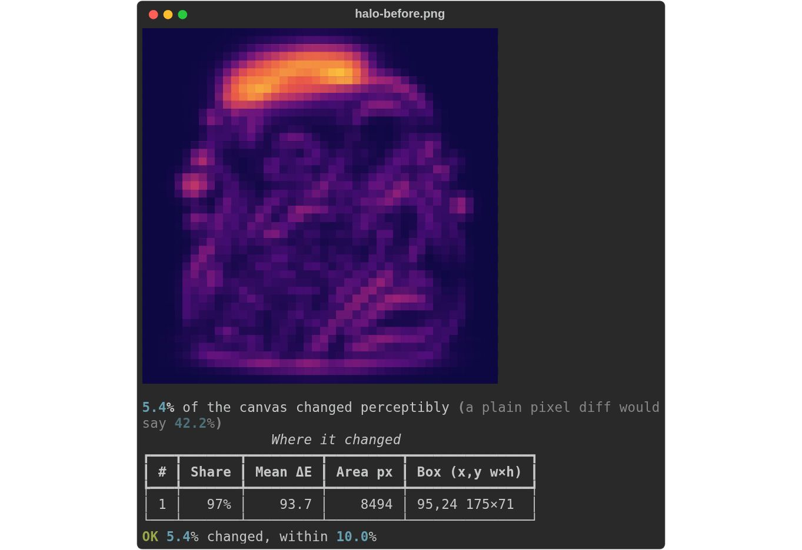
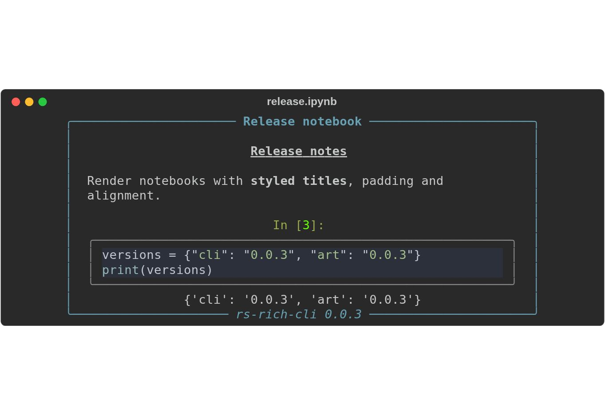

# 0.0.3 release notes

0.0.3 improves rendering correctness, CLI behavior and release verification.
These notes describe the finalized source snapshot. The package pages below
show registry availability; a source merge alone does not publish a package.

| Package | Version | Changes |
|---|---|---|
| [rs-rich](https://crates.io/crates/rs-rich/0.0.3) | 0.0.3 | Title/caption markup, styled Unicode truncation, JSON precision/depth, Markdown parity and Windows paging. |
| [rs-rich-ext](https://crates.io/crates/rs-rich-ext/0.0.3) | 0.0.3 | Updated dependency on core 0.0.3. |
| [rs-rich-art](https://crates.io/crates/rs-rich-art/0.0.3) | 0.0.3 | Safe first-frame GIF/Stage output when redirected. |
| [rs-rich-cli](https://crates.io/crates/rs-rich-cli/0.0.3) | 0.0.3 | Graphical exports, notebook layout, CSV streaming, input hints and clearer option handling. |

Each crate retains independent SemVer. All four change in this release because
of their changes and dependency requirements; future releases may select one
crate through its own tag.

## Graphical exports with redirected stdout

Diff HTML/SVG retain colored half-block graphics when stdout is redirected.
Terminal output stays readable ASCII, and threshold verdicts stay identical.
Explicit ASCII, no-image and no-color choices remain respected; Sixel requests
use half-block graphics in exported documents.

```bash
rich --diff before.png after.png --threshold 10 \
  --export-html report.html --export-svg report.svg > report.txt
```



This screenshot shows the actual CLI SVG export of the repository's halo image
fixtures. The pictured threshold verdict is computed by the CLI.

## Notebook layout and styled titles

Notebook cells and their outputs now receive padding, panels, styles, width and
alignment as one group. Panel, Rule and Table labels interpret markup and measure
visible cells. Styled Unicode truncation preserves valid span boundaries.

```bash
rich --ipynb release.ipynb --width 64 --center --padding 0,1 \
  --panel rounded --panel-style cyan \
  --title '[bold cyan]Release notebook[/]' \
  --caption '[italic]rs-rich-cli 0.0.3[/]' --export-svg notebook.svg
```



Both screenshots are unedited browser captures of actual CLI SVG output.

## Other fixes

- JSON preserves large integer digits, accepts deep nesting and renders
  overflowing exponents as signed Infinity, matching Python behavior.
- Undecorated CSV output streams styled rows, and early-closing consumers such
  as `head` terminate successfully. Source rows still require memory.
- Redirected GIFs print their first frame once, including infinite-repeat input,
  without emitting animation controls.
- Windows pager fallback explicitly launches `more.com`; native Windows CI
  verifies both process execution and complete output.
- Unsupported demo/GIF options fail clearly. Interactive stdin explains EOF;
  non-empty `NO_COLOR`, pager precedence and GIF loop defaults are documented.

## Verification and remaining scope

The release uses pinned Python Rich 15.0.0 golden fixtures, default and feature
builds, MSRV checks, native Windows pager tests, POSIX terminal probes and
independent review. Package dry runs verify the packaged workspace and sibling
dependencies before upload; the release workflow verifies exact registry
versions in fresh consumers after publishing.

The optional `json-escape-safe` feature remains off by default. GIF block
rendering, additional encoding support, further CSV memory reductions and
long-line/syntax performance work are deferred. See [known issues](../known-issues.md),
[UAT closeout](../remaining-uat-0.0.3.md) and the [roadmap](../ROADMAP.md).

The complete changes are in the
[0.0.3 changelog](https://github.com/buchochelliq-labs/rs-rich-cli/blob/main/CHANGELOG.md#003--2026-09-10).
