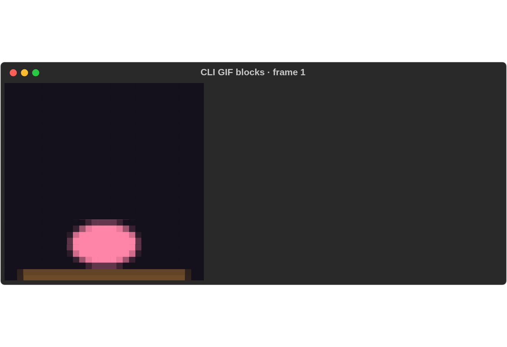
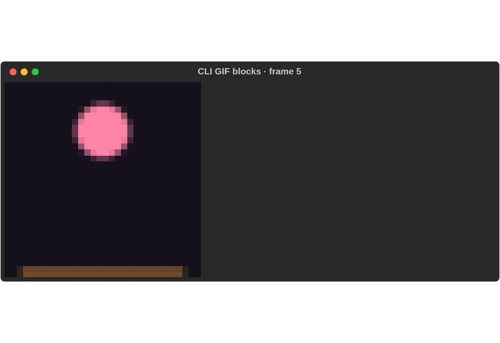

# 0.0.4 release notes

**Released 2026-09-10.** All four packages are published at 0.0.4 on crates.io.
The annotated `v0.0.4` tag points to [main commit `355a333`](https://github.com/buchochelliq-labs/rs-rich-cli/commit/355a333b853606fcff830f498db1c35b9f94061d).
The [protected release workflow](https://github.com/buchochelliq-labs/rs-rich-cli/actions/runs/34451499873) passed the full source gate,
package dry runs, uploads and exact-version verification in fresh consumers.

This release includes reviewed diagnostics, GIF rendering, CSV memory,
wrapping and optional syntax-cache changes. The screenshots below are actual
CLI output; performance results retain their original measurement conditions.

## Package selection

| Package | Published version | Changes |
|---|---|---|
| [rs-rich](https://crates.io/crates/rs-rich/0.0.4) | 0.0.4 | Ownership extension point for tables; wrapping optimization and optional syntax cache. |
| [rs-rich-ext](https://crates.io/crates/rs-rich-ext/0.0.4) | 0.0.4 | Explicit UTF-8/UTF-16 decoding; updated core dependency. |
| [rs-rich-art](https://crates.io/crates/rs-rich-art/0.0.4) | 0.0.4 | GIF half-block rendering; updated core dependency. |
| [rs-rich-cli](https://crates.io/crates/rs-rich-cli/0.0.4) | 0.0.4 | Input diagnostics, encoding and GIF selectors, and reduced CSV copies. |

Every crate keeps independent SemVer. Each changed in this release, including
its affected internal dependency requirements. The coordinated `v0.0.4` tag
selected all four; future releases can still select a single changed crate.

Install the exact released CLI:

```bash
cargo install rs-rich-cli --version '=0.0.4' --locked
```

To opt into repeated-source syntax reuse, add `--features syntax-cache`.
Default installations retain the normal uncached Syntect path.

## Explicit text decoding and clearer diagnostics

Image-input errors now lead with an actionable hint and clean extension spelling.
The optional `--encoding` selector supports strict `utf-8`, `utf-16`, `utf-16le`
and `utf-16be` decoding for files, stdin and supported URL input. Generic UTF-16
requires a BOM; endian-specific choices also support headerless text. Malformed
input fails clearly. Default decoding remains compatible with upstream; it does
not guess headerless encodings.

```bash
rich notes.txt --encoding utf-16
rich notes.txt --encoding utf-16le
```

See [text encoding](../troubleshooting.md#text-encoding) for BOM handling,
malformed input and the distinction between default and explicit decoding.

## GIF half-block rendering

```bash
rich --gif animation.gif --gif-mode blocks --width 40 --loop 2
```

Existing GIF invocations retain ASCII output. Explicit blocks use terminal color
capabilities; no-color or ASCII-only destinations fall back to ASCII. Redirected
stdout still emits one ASCII frame without animation controls or waiting, even
with `--loop 0`. Image-diff mode selection remains separate.





These are sequential captures of actual CLI PTY output. See the
[capability matrix and playback limitations](../cli.md#gif-half-block-rendering-004).
Ctrl-C can leave the cursor hidden, as with existing ASCII playback. Sixel GIF
output and GIF HTML/SVG export are outside this release.

## Measured performance improvements

Measurements are from optimized Linux development builds on one host, with
fixed fixtures and output comparisons. They are not cross-platform guarantees.
See [benchmarks](../benchmarks.md) for commands, raw samples and baseline details.

| Workload | Before | Development result | Interpretation |
|---|---:|---:|---|
| CSV, 100k rows, peak RSS | 49,884 KiB | 27,088 KiB | About 46% lower peak memory by transferring ownership instead of duplicating cells and row containers. |
| Text wrapping, 1 MiB | 3,998 ms | 87 ms | Removes repeated work on the measured extensionless Text CLI path. |
| Markdown paragraph, 1 MiB | 4,143 ms | 113 ms | Long-paragraph wrapping improvement. |
| Markdown paragraph, 5 MiB | >10,000 ms timeout | 531 ms | Completes within the baseline timeout. |
| Repetitive syntax fixture, about 199 KB | 630 ms | 159 ms | About 75% faster with the optional `syntax-cache` Cargo feature. |
| Real CLI source syntax fixture | 445 ms | 442 ms | No demonstrated speed improvement on this representative input. |
| Text-module syntax fixture | 254 ms | 257 ms | No measured improvement. |

The extensionless Text CLI rows differ from legacy `.txt` cases, which select
the plain Syntax renderer. Syntax timings use the off-by-default `syntax-cache`
Cargo feature. Enable it with
`cargo build -p rs-rich-cli --release --features syntax-cache`. Default builds
retain the uncached Syntect path. The cache benefits repeated eligible lines;
it does not imply a general startup or highlighting speedup. Existing syntax and
theme caches remain, grammars are retained, and syntect/Pygments differences
remain documented.


CSV still retains source rows for inference and global width measurement.
Decorated, aligned, paged and exported paths can retain rendered lines; this is
not constant-memory processing. The measured decorated 10k-row peak RSS remains
about 111 MiB. Two-pass reading and stdin spooling remain possible future work.

## Release verification

The tagged commit passed formatting, Clippy, workspace tests, the feature
matrix, declared MSRV, native Windows coverage, pinned Rich 15 goldens and
release-workflow regressions. The release job then packaged and uploaded all
four crates and verified each exact 0.0.4 version outside the repository.
The CLI was installed with `--version =0.0.4 --locked`; fresh consumers compiled
against exact versions of each selected library.

The [release run](https://github.com/buchochelliq-labs/rs-rich-cli/actions/runs/34451499873) records these results.
[Preparation PR #119](https://github.com/buchochelliq-labs/rs-rich-cli/pull/119)
retains the earlier package dry run, independent review and CLI evidence.
Generated version tables and CLI help match the published packages.

These versions are immutable. Do not rerun the upload path for `v0.0.4`.
Verification-only recovery retains the tag, ancestry and full-CI gates while
skipping uploads; it cannot finish a partially published release. See
[Branching and releases](../BRANCHING.md#publish-order).

The [0.0.4 development plan](../plans/0.0.4.md) is the completed scope record.
The [proposed 0.0.5 plan](../plans/0.0.5.md) covers targeted goldens,
differential fuzzing, library benchmarks and opt-in input sanitization.
Broader API additions, bounded-memory CSV processing, new syntax engines and
additional graphics protocols remain separate work.
