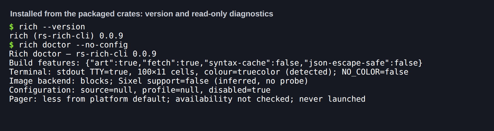
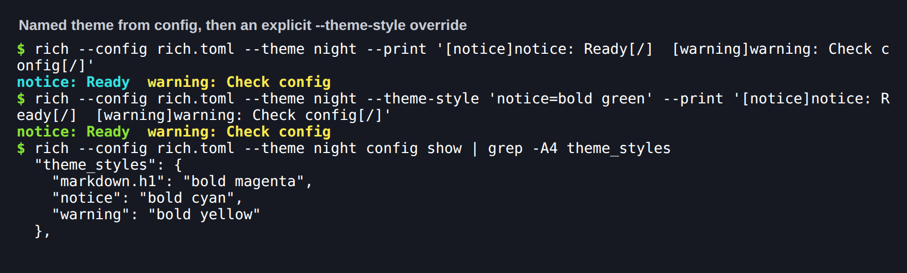
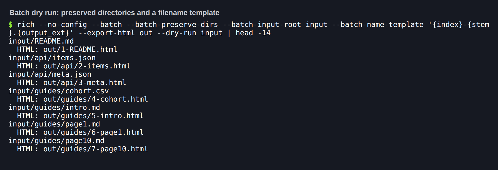
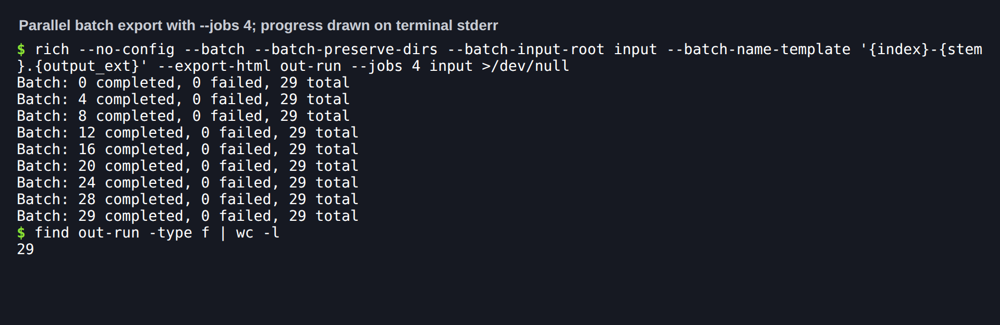
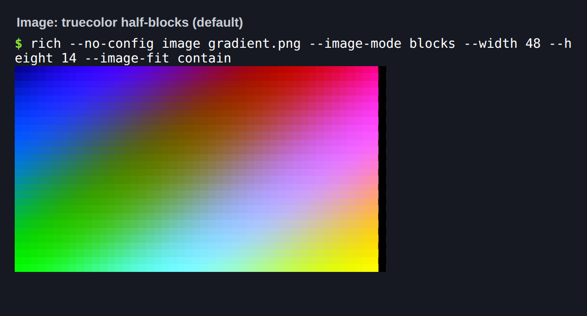
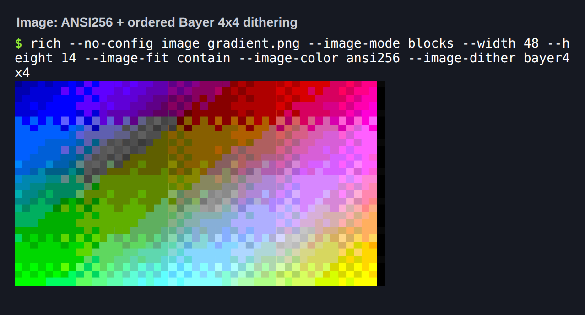
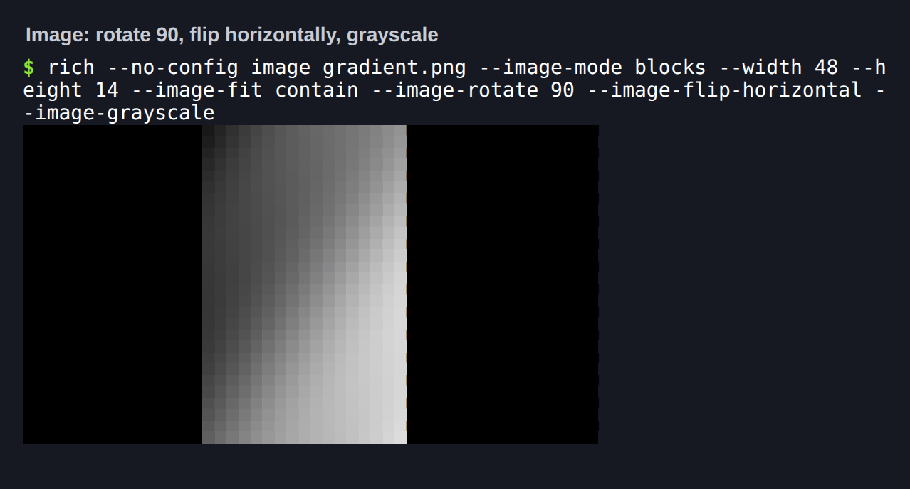
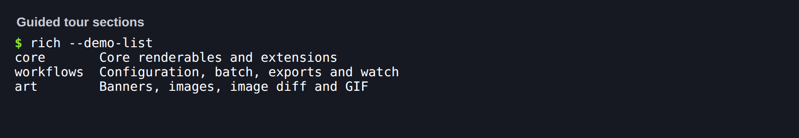

# Expanded CLI 0.0.9 preparation

Status: implemented on the release branch; independent review findings reproduced
and fixed; the release test below passed on 2026-09-22. Awaiting maintainer merge.
This is not a publication announcement.

The cohort is core 0.0.5, ext 0.0.7, art 0.0.7, CLI 0.0.9. Live registry checks on
2026-09-21 returned 404 for all four proposed versions and 200 for the previous
core 0.0.4/ext 0.0.6. Publish core first, then ext/art, then CLI. Recheck registry
state at publication time; no release tag or upload is part of this preparation.

## Evidence

- Default formatting, Clippy and workspace tests pass, including core goldens.
- All-feature Clippy/tests, defaultless ext/art/CLI builds and Rust 1.90 checks pass.
- Cross-feature tests cover nested transformed images, diagnostic HTML/SVG and
  identical serial/parallel Bayer batch exports with exact planned names.
- Live virtual-screen tests and real PTY resize/ordinary-write/cleanup checks pass.
- Python release automation regressions pass.
- Staged package verification passed for all four publishable crates, including
  packaged examples and dependency manifests. This is not registry publication readiness.
- Final default suite: 642 passing tests. The initial all-feature workspace suite
  passed 647 tests; after review fixes, the affected ext/art all-feature suites
  passed 142 tests, with all-feature workspace Clippy and Rust 1.90 rechecked.
  Strict MkDocs and generated CLI/version references pass.
- Independent review found six Important defects and one Minor issue, all reproduced
  and fixed with regressions. No Critical issues. See the
  [review and disposition](../superpowers/specs/2026-09-21-cli-0.0.9-design-review.md).
  The reviewer assessed the earlier commit; no second review approval is claimed.

Reproduce with `python scripts/capture_expanded_v9.py`. Raw source, HTML/SVG and
hash provenance are in `docs/media/expanded-v9`. The same-source Sixel artifact
contains actual PTY protocol output, not a terminal-emulator screenshot. The comparison contains actual
exports; only captions and grid placement are added. No synthetic terminal image.

## Release test (2026-09-22)

Run on the release branch after the two P2 review fixes (tiny-viewport Live writes,
CRLF diagnostic snippets), with Rust 1.98.1 stable, `NO_COLOR` unset.

| Check | Result |
|---|---|
| `python scripts/validate_release.py --tag rs-rich-v0.0.5` | All 15 steps pass: fmt, three Clippy configurations, 830 Rust tests (0 failed), lean CLI tests, 33 Python release tests, version/CLI-reference checks, locked check, staged packages |
| `capture_golden.py` against real `rich` 15.0.0 (dedicated venv, no rich-cli) | Fixtures regenerate byte-identically |
| `release.py plan` per tag | `rs-rich-v0.0.5`, `rs-rich-ext-v0.0.7`, `rs-rich-art-v0.0.7`, `rs-rich-cli-v0.0.9` each select exactly their own package |
| `release.py plan v0.0.9` | Rejected: `rs-rich-art: manifest says 0.0.7, tag says 0.0.9` |
| crates.io API | 404 for all four new versions; 200 for published core 0.0.4 and CLI 0.0.8 |
| Consumer install | `cargo install` from the packaged `rs-rich-cli-0.0.9` source, with siblings patched only to their packaged `.crate` contents: release build succeeds, `rich --version` reports 0.0.9 |
| Codex P2 (serial `--collision suffix` with output aliases, reported on `54d651f`) | Does not reproduce after #196: a symlinked output directory is refused before any write (exit 3); a symlinked output file is replaced rather than written through. Pinned by `serial_suffix_never_writes_through_output_aliases` |
| Library consumer | Fresh crate pinned to `=0.0.5`/`=0.0.7` packaged core/ext renders a CRLF snippet with no carriage returns and a width-1 Live `print` that delivers every character |

The patched consumer stands in for registry resolution until the dependencies are
published; the release workflow's exact-version registry consumers remain required.

### Tags to publish

Independent, annotated tags on the merged `main` commit, in this order. Verify each
registry consumer before tagging dependents. Do not use a coordinated `v0.0.9`.

1. `rs-rich-v0.0.5`
2. `rs-rich-ext-v0.0.7` and `rs-rich-art-v0.0.7`
3. `rs-rich-cli-v0.0.9`

### Installed-binary screenshots

Each image is a real PTY run of the installed consumer binary (`TERM=xterm-256color`,
truecolor); the captured bytes are replayed verbatim into xterm.js in headless Chromium.
Only the caption line is added. Hashes of the raw PTY bytes and PNGs are in
[`provenance.json`](../media/release-0.0.9/provenance.json); reproduce with
`scripts/terminal_shots/`.

The one-column black edge on the contained images is letterboxing: the 160×96
source fitted into a 48×28-pixel box is 46.7 pixels wide.

## Acceptance mapping

| Issues | Delivered branch acceptance | Disposition before merge |
|---|---|---|
| #132, #133 | Explicit nested context/targets, injectable capabilities, doctor provenance | Review; close after merged acceptance |
| #134, #149 | Deterministic bounded constraints, intrinsic sizing, shared overflow | Review; existing core Layout remains usable |
| #136, #146, #151 | Typed events, ordered fields, diagnostics, supplied snippets, adapters, export fidelity | Review; existing logging/traceback unchanged |
| #145 | Single-writer independent regions, log routing, bounded resize, cleanup | Review; coordinated writes must use the handle |
| #150 | Optional target-controlled JSON/ANSI/segment snapshots and first-difference output | Review; raw render line endings preserved |
| #142, #157 | Templates, preserved subdirectories, preflight, collision rules, bounded workers | Review; UTF-8 CLI path limitation documented |
| #123, #124 | All dot mappings, partial/odd cells, transparency and same-source outputs | Review; optional quadrants deferred |
| #6, #10 | Selected Live prerequisites and optional log/tracing integration | Keep open for broader upstream parity |
| #125 | Ordered Bayer for ANSI256 ASCII/blocks | Keep open for broader color roadmap |
| #126 | Rotation/flips/grayscale and compositing/contain behavior | Keep open for remaining transforms/alpha roadmap |
| #144 | Explicit target routing and migration documentation | Keep open for future renderer/backend APIs |

## Boundaries and migration

New rendering implementations live in ext/art. The sole core addition is the
sanctioned optional environment trait seam, preserving legacy defaults. No required
Renderable methods or ConsoleOptions/ImageOptions fields were added.

Source snippets are caller-supplied UTF-8 strings; no source-file discovery occurs.
Snippet and underline rows crop together while prose can fold. Applications install
and filter their own optional log/tracing adapter. Expanded `Value` and `Dither`
enums require downstream exhaustive matches to account for new variants.

A Live coordinator owns one writer for its lifetime. All concurrent console text
must route through its handle. One guard column and one insertion row are reserved;
resize requires callers to rerender region contents. Finish and create a new
coordinator to switch terminal/pipe policy. Cleanup cannot run after SIGKILL/abort.

New batch naming modes accept export directories. Existing flat naming and the
three actual collision policies are retained. No new skip policy is introduced.
Generic one-shot CLI streams retain one capture pass; decoded images can render
separately against terminal and export targets. Exports filter terminal controls.

## Batch filesystem hardening (#196)

The parent now retains output directory handles and publishes successful worker
exports from private staging. Descendant symlink/junction traversal is rejected;
missing directories are created relative to retained handles. Overwrite replaces
entries rather than truncating existing inodes, protecting other hard links and
symlink targets. No-overwrite uses exclusive creation, including for collisions
introduced after planning. The exact directory-object boundary, metadata changes,
partial-new-file behavior and cancellation semantics are documented in the
[CLI batch contract](../cli.md#directory-preserving-batch-names).

Controlled tests cover late leaf links/collisions, parent replacement, missing-root
ancestor replacement, traversal rejection and failed overwrite copies. Windows CI
also exercises hard links, exclusive creation and junction rejection. Local follow-up verification: 655 default tests pass, including 12 focused Unix
race/privacy/cancellation tests; default and lean CLI Clippy, Rust 1.90 all-feature
checks, Windows lean all-target cross-check, strict MkDocs and real batch
cancellation/progress checks pass. Fresh independent review found permission and
cancellation defects; both were reproduced and fixed, and the final review found
no remaining blockers within the documented threat model. Real Windows ACL,
junction and publication behavior is gated by the extended Windows CI job.
