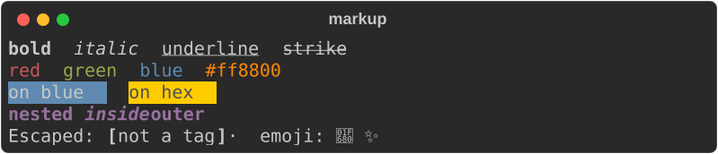
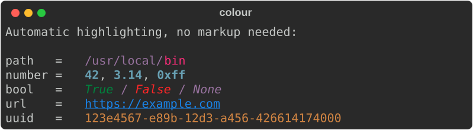

# 2. Markup and style

## Tags

A tag names a style. Styles combine, and tags nest:

```rust
console.print_str("[bold]bold[/] [italic]italic[/] [underline]underline[/]");
console.print_str("[red]red[/] [white on blue]white on blue[/]");
console.print_str("[bold magenta]outer [italic]and inner[/] again outer[/]");
```



`[/]` closes the most recent tag; `[/bold]` closes a named one. Both work, and
abbreviations resolve — `[b]…[/bold]` matches, because tag names are normalised
before they are compared.

## What can go in a tag

| Form | Example |
|---|---|
| Attribute | `bold` `dim` `italic` `underline` `strike` `reverse` |
| Abbreviation | `b` `d` `i` `u` `s` `r` |
| Negation | `not bold` |
| Named colour | `red` `bright_blue` `grey37` |
| Hex | `#ff8800` |
| RGB | `rgb(255,136,0)` |
| 8-bit index | `color(196)` |
| Background | `on blue`, `white on #202020` |
| Hyperlink | `link https://example.com` |
| Theme name | `repr.number`, or any name your theme defines |

Combine them freely: `[bold not italic #ff8800 on grey15]`.

## Styles as values

Markup is a convenience. The underlying type is `Style`:

```rust
use rich::{Console, Style, Text};

let console = Console::new();
let style = Style::parse("bold underline").unwrap();
console.print(&Text::styled("styled directly", style));
```

## Automatic highlighting

A `Console` highlights recognisable things without being asked — numbers, paths,
URLs, UUIDs, booleans, `None`:



This is on by default, matching upstream. Turn it off when the text is not
code-like:

```rust
let console = Console::builder().highlight(false).build();
```

## Themes

A theme maps names to styles. Because span styles are resolved **when the text is
rendered**, not when it is created, changing the theme restyles output that was
already built:

```rust
use rich::{Console, Style, Theme};

let mut theme = Theme::default_theme();
theme.insert("repr.number", Style::parse("bold red").unwrap());

let console = Console::builder().theme(theme).build();
console.print_str("answer = 42");     // 42 is bold red, not the default cyan
```

The same applies to your own names:

```rust
theme.insert("danger", Style::parse("bold white on red").unwrap());
console.print_str("[danger] DANGER [/]");
```

!!! note "Unknown tags are not an error"

    `[nope]x[/]` renders `x` with no styling, exactly as upstream does. A
    *malformed* tag — an unmatched `[/close]` — is still an error.

Next: [Tables →](03-tables.md)
