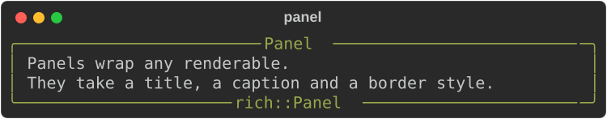
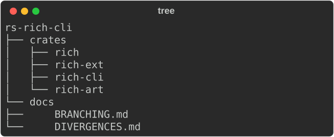
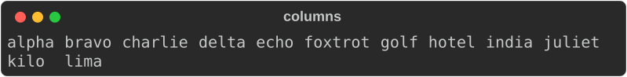
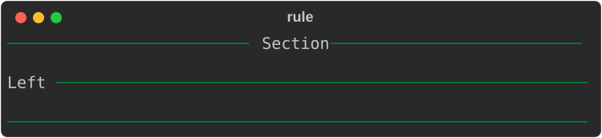
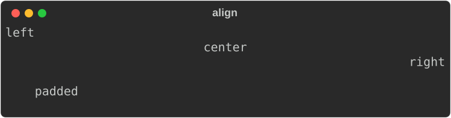
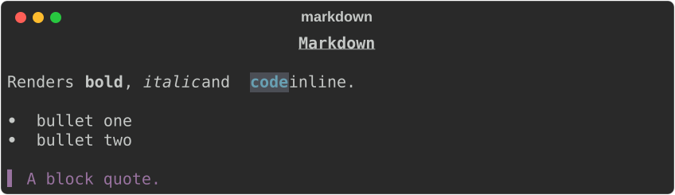
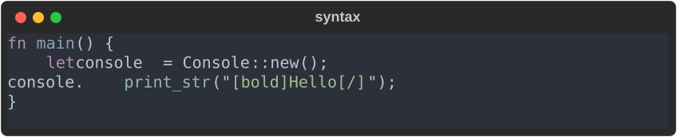
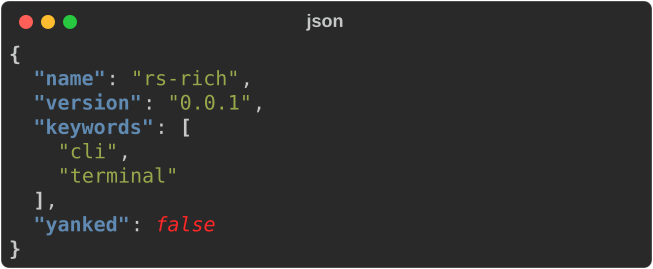

# 4. Layout

Every layout type takes a `Box<dyn Renderable>`, so they nest freely — a table
inside a panel inside a column.

## Panels

```rust
use rich::{Console, Panel, Style, Text};
use rich::r#box::ROUNDED;

let inner = Text::new("Panels wrap any renderable.");
let panel = Panel::new(Box::new(inner))
    .box_set(ROUNDED)
    .title("Panel")
    .subtitle("rich::Panel")
    .border_style(Style::parse("green").unwrap());

console.print(&panel);
```



## Trees

```rust
use rich::Tree;

let mut tree = Tree::new("rs-rich-cli");
let crates = tree.add("crates");
crates.add("rich");
crates.add("rich-ext");
tree.add("docs");

console.print(&tree);
```



`add` returns a mutable reference to the child, so you descend by binding it.

## Columns

```rust
use rich::Columns;

let items = vec!["alpha".into(), "bravo".into(), "charlie".into()];
console.print(&Columns::new(items));
```



As many equal columns as fit, filled row by row.

## Rules

```rust
use rich::{HorizontalAlign, Rule};

console.print(&Rule::new("Section"));
console.print(&Rule::new("Left").align(HorizontalAlign::Left));
console.print(&Rule::line());          // no title
```



## Alignment and padding

```rust
use rich::{Align, Padding, Text};

let boxed = |s: &str| Box::new(Text::new(s)) as Box<dyn rich::Renderable>;

console.print(&Align::center(boxed("centred")));
console.print(&Padding::new(boxed("padded"), (1, 4, 1, 4)));   // top, right, bottom, left
```



## Documents

Markdown and source code are renderables too:

```rust
use rich::markdown::Markdown;
use rich::{Json, Syntax};

console.print(&Markdown::new("# Title\n\nWith **bold** text."));
console.print(&Syntax::new("fn main() {}", "rs"));
console.print(&Json::new(r#"{"a": 1}"#).unwrap());
```







Next: [Progress and live output →](05-live.md)
